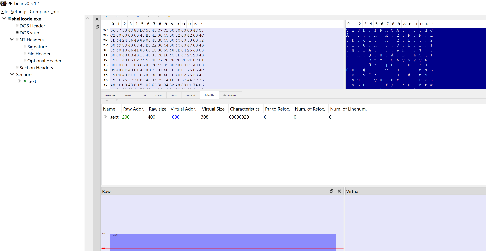
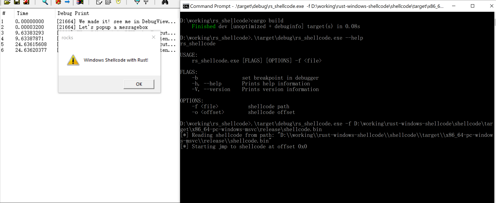

# Write Windows Shellcode in Rust


## Project overview

Windows shellcode project is located in `shellcode/`, it can build into a PE file with only `.text` section 
and has no external dependencies.



Then we can dump the `.text` section and do some patches to make it position-independent. this idea 
was from [hasherezade](https://twitter.com/hasherezade)'s project [masm_shc](https://github.com/hasherezade/masm_shc).


## How to build it

(Only tested on Win10 x64)


### Build shellcode binary


```sh
rustup default nightly-x86_64-pc-windows-msvc
cd shellcode/
cargo build --release
```

If everthing goes well, we will get `shellcode\target\x86_64-pc-windows-msvc\release\shellcode.exe`

### Dump .text section and do some patches 

We patch at the start of `.text` section, make it jump to entry point. In this way, we can have some strings store in the merged section, or we have to use `u8` and `u16` bytes array on stack to represent string.

```sh
cd ..
cargo run
```


We will get  `shellcode\target\x86_64-pc-windows-msvc\release\shellcode.bin`, this is the final shellcode file.


### Test shellcode

Test the shellcode use your favorite shellcode loader, i use my own little tool [rs_shellcode](https://github.com/b1tg/rs_shellcode) for demonstration.

```sh
git clone https://github.com/b1tg/rs_shellcode
cd rs_shellcode/
cargo build
./target/debug/rs_shellcode.exe -f "shellcode\target\x86_64-pc-windows-msvc\release\shellcode.bin" 
```

This demo shellcode will popup a message box and print some log use `OutputDebugStringA`, you can check it out in [debugview](https://docs.microsoft.com/en-us/sysinternals/downloads/debugview) or windbg.




## References

- https://github.com/mcountryman/min-sized-rust-windows
- https://github.com/hasherezade/masm_shc
- https://github.com/Trantect/win_driver_example
- https://not-matthias.github.io/kernel-driver-with-rust/
- https://github.com/pravic/winapi-kmd-rs
- https://github.com/johnthagen/min-sized-rust
